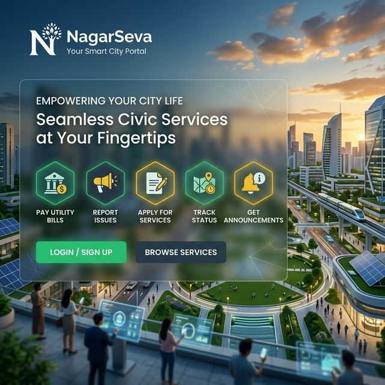

# 🏙️ NagarSeva: Smart Civic Complaint & Tracking Portal

[](https://nagar-seva-iota.vercel.app/)
[](https://nextjs.org/)
[](https://supabase.com/)
[](https://deepmind.google/technologies/gemini/)



## 🚀 Overview

**NagarSeva** is a state-of-the-art, AI-powered civic engagement platform designed to bridge the gap between citizens and municipal authorities. Built with a focus on transparency, efficiency, and real-time responsiveness, it empowers citizens to report issues effortlessly while providing administrators with robust tools for field agent management and complaint resolution.

### [🔗 Live Demo](https://nagar-seva-iota.vercel.app/)

---

## ✨ Key Features

### 🤖 Context-Aware AI Chatbot
- **Page-Specific Intelligence**: Whether you're a citizen, an admin, or a volunteer, the Gemini-powered AI provides contextual assistance tailored to your current view.
- **Natural Language Reporting**: Simplifies the complaint filing process through guided interactions.

### 🛠️ Robust Worker Management
- **Intelligent Assignment**: Supports both manual and automated (Round Robin) task assignment to field agents.
- **Workload Tracking**: Real-time monitoring of agent tasks and performance.
- **Atomic Updates**: Ensures data consistency through server-side API integration.

### 📊 Comprehensive Dashboards
- **Citizen Portal**: Track reported issues with live progress bars and multimedia evidence.
- **Admin Command Center**: Holistic view of city-wide issues with advanced analytics and mapping.
- **Volunteer/Field Agent Mode**: On-duty tracking and step-by-step resolution flow.

### 📍 Geolocation & Multimedia
- **Interactive Mapping**: Precision location reporting using GPS coordinates.
- **Evidence Support**: Attach high-quality images and videos for faster incident verification.

---

## 🛠️ Tech Stack

- **Frontend**: [Next.js 15](https://nextjs.org/) (App Router), [Tailwind CSS](https://tailwindcss.com/)
- **UI Components**: [Shadcn UI](https://ui.shadcn.com/), [Lucide React Icons](https://lucide.dev/)
- **State Management**: [TanStack Query v5](https://tanstack.com/query/latest)
- **Backend & Auth**: [Supabase](https://supabase.com/) (PostgreSQL + RLS)
- **AI Engine**: [Google Gemini 2.0 Flash](https://deepmind.google/technologies/gemini/)
- **Styling**: Vanilla CSS + Modern Glassmorphism

---

## 📁 Project Structure

```text
immortals/
├── src/
│   ├── app/            # Next.js Route Handlers & Pages
│   ├── components/     # Atomic UI & Feature-specific Components
│   ├── hooks/          # Custom React hooks (Data fetching, Auth)
│   ├── lib/            # Shared Utilities & Supabase Client
│   ├── services/       # Core Business Logic & API Layer
│   └── types/          # Centralized TypeScript Definitions
├── public/             # Static Assets & Hero Images
└── supabase/           # SQL Schemas & Database Migrations
```

---

## 🚦 Getting Started

### Prerequisites
- Node.js 20+
- Supabase Project
- Google Gemini API Key

### Installation

1. Clone the repository:
   ```bash
   git clone https://github.com/SumitPujari30/immortals.git
   cd immortals
   ```

2. Install dependencies:
   ```bash
   npm install
   ```

3. Set up environment variables (`.env.local`):
   ```env
   NEXT_PUBLIC_SUPABASE_URL=your_supabase_url
   NEXT_PUBLIC_SUPABASE_ANON_KEY=your_supabase_anon_key
   SUPABASE_SERVICE_KEY=your_service_role_key
   GEMINI_API_KEY=your_gemini_key
   ```

4. Run the development server:
   ```bash
   npm run dev
   ```

---

## 📜 License

NagarSeva is built by **Sumit Pujari (SumitPujari30)**. All rights reserved. 🏙️